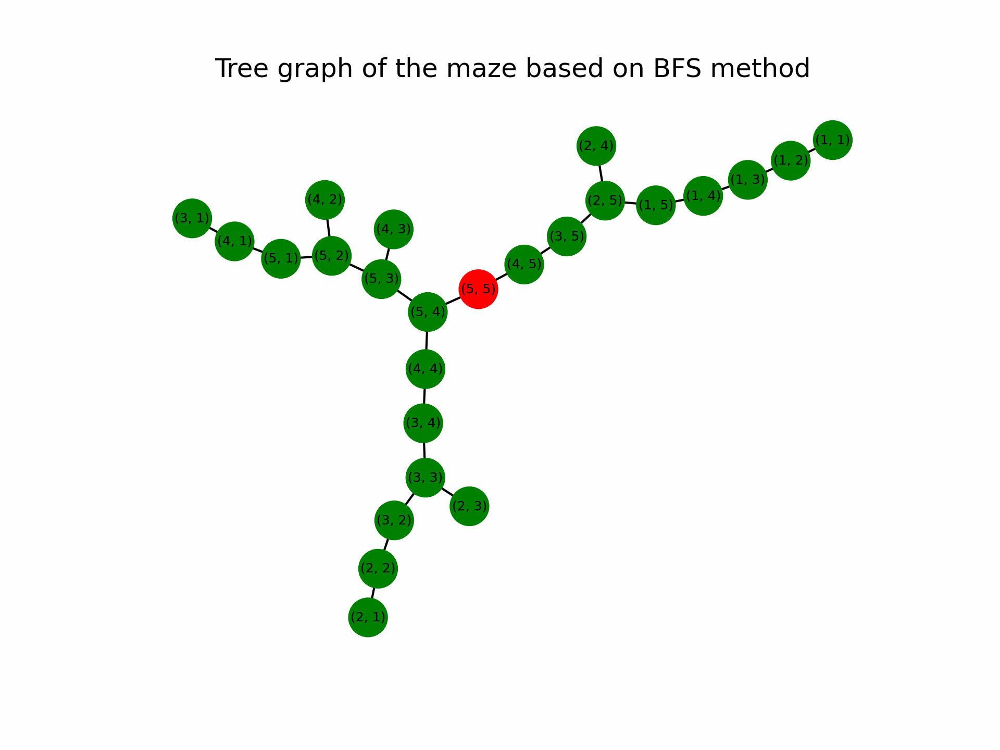
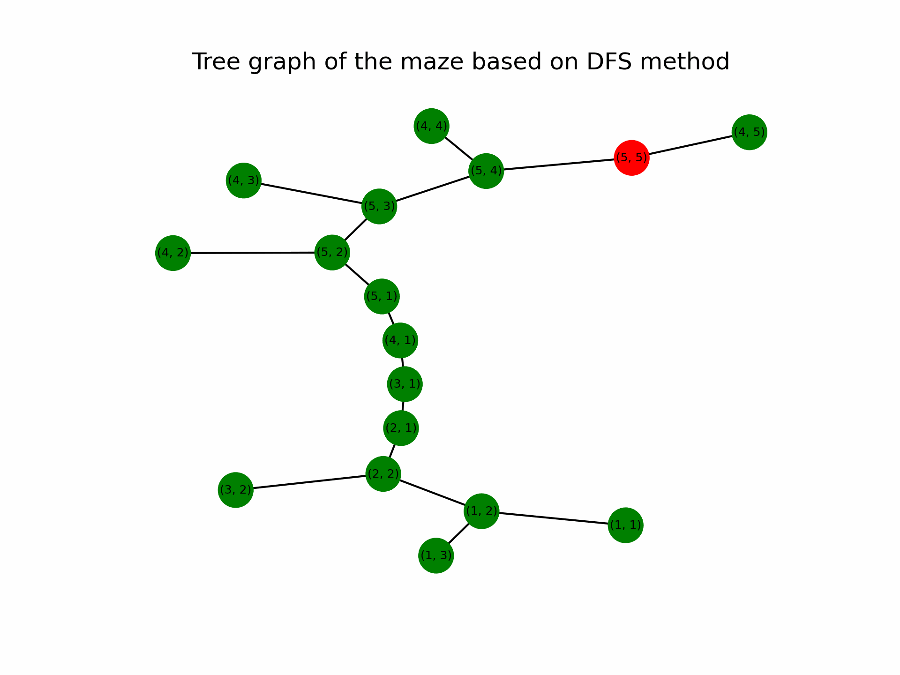

# AI-Class 

This repository contains task submissions and learning materials created during a class on **Introduction to Artificial Intelligence**.

---

- `ann.ipynb`
  implementation of simple artificial neural network on MNIST dataset.
- `cnn.ipynb`
  implementation of convolutional neural network on MNIST dataset.
- `gan.ipynb`
  implementation of generative adversarial network.
- `graph-algorithm.ipynb`
  breadth-first seach (BFS) and depth-first search (DFS) algorithm.
  <table align="center">
    <tr>
      <td align="center">
        <strong>Breadth-First Search</strong>  
         
        <em>Breadth-First Search traversal on a tree</em>
      </td>
      <td align="center">
        <strong>Depth-First Search</strong>  
         
        <em>Depth-First Search traversal on a tree</em>
      </td>
    </tr>
  </table>
